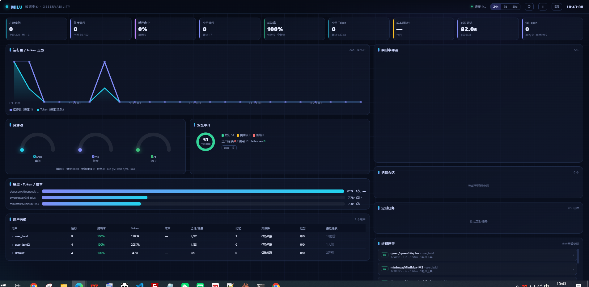
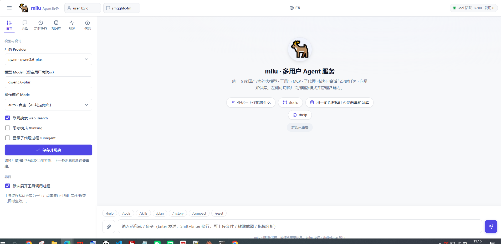
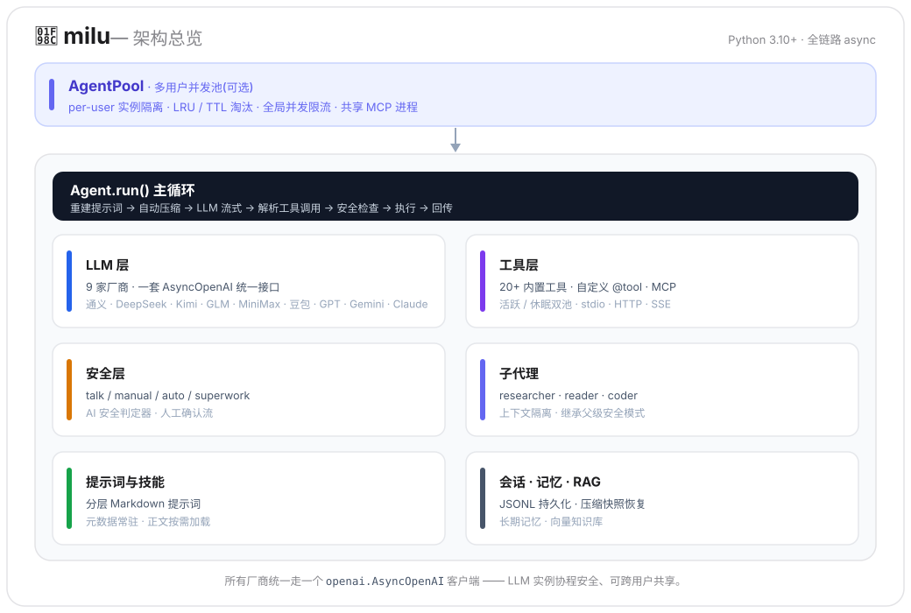

<div align="center">

# 🦌 milu（麋鹿）

**生产级多用户 Agent 框架 —— 国产大模型一等公民。**

多用户并发池 · 一套接口接入 9 家大模型（国产一等公民） · 内置工具与 MCP · 子代理 · 技能 · RAG 知识库 · 定时任务 · 观测大屏

[](https://pypi.org/project/milu/)
[](https://github.com/stephonGAO/milu/actions/workflows/ci.yml)
[](https://pypi.org/project/milu/)
[](LICENSE)
[](tests/)

[English](README.md) | **简体中文**


<sub>多用户 Web 前端 · <code>milu serve</code> —— 流式对话，工具、技能、子代理开箱即用</sub>



<sub>内置跨用户观测大屏 · <code>milu serve</code> → <code>/dashboard</code></sub>

</div>

---

## 为什么是 milu？

多数 agent 框架止步于单用户 demo，又把国产模型当二等公民。milu 从它们止步的地方开始：

- 🏭 **一个库走完 demo 到生产**<br>
  `AgentPool` 提供 per-user 实例隔离、LRU/TTL 淘汰、全局并发限流、共享 MCP 进程。每个框架都留给你自己解决的问题——*「demo 跑通了，怎么让 100 个用户同时用且会话互不串扰？」*——这里有现成答案，1100+ 测试兜底。同一个池还能把租户映射到各自的 API Key（`KeyedLLMProvider`），从个人项目平滑长到多租户 SaaS。
- 🇨🇳 **国产模型一等公民**<br>
  通义千问、DeepSeek、Kimi、GLM、MiniMax、豆包原生支持，与 OpenAI、Gemini、Claude 同级。不用自己维护 base_url 路由表，各家的思考模式、自带联网搜索、参数差异已经适配好，搜索工具自带国内可直连的后端（博查）。
- 🔋 **真·开箱即用**<br>
  20+ 内置工具（文件、Shell、Python、网页抓取/搜索、Office/PDF 文档读取、图片视觉输入）、MCP 协议（stdio/HTTP/SSE）、子代理、技能、会话持久化、上下文自动压缩、长期记忆、RAG 知识库、定时任务，外加一个内置的多用户 Web 服务。
- 🛡️ **真正的安全模型**<br>
  四种操作模式（`talk` / `manual` / `auto` / `superwork`）、不安全工具调用的 AI 安全判定器（对齐 Claude Code）、人工确认流，且子代理委派永不旁路审批。
- 🔭 **内置可观测性**<br>
  每次 `Agent.run()` 即一棵 span 树（属性命名对齐 OpenTelemetry GenAI 语义约定）：单次运行的 token / 成本 / 延迟、TTFT、LLM vs 工具 vs 安全判定 vs 审批等待的时间分解、子代理嵌套、fail-open 审计。可经 CLI（`milu trace list/show/compare/stats`）、Web「观测」面板看单次运行的链路瀑布，或经 `/dashboard` 的**跨用户观测大屏**（见上图）——资源池与并发仪表、运行 / Token 走势、安全审计环形、模型成本、用户画像与跨所有用户的实时事件流，经 `MILU_ADMIN_TOKEN` 鉴权。
- 🪶 **薄封装，不造概念**<br>
  直接以 `openai` SDK 为统一 HTTP 客户端，事件以普通 dataclass 流式输出。没有链、没有图、没有需要学习的 DSL。

## 两种用法

milu 既是开箱即用的完整 Agent，也是可二次开发的框架——即开即用，需要时再嵌入：

- 🚀 **直接用**<br>
  `milu` 进入对话、`milu serve` 起多用户服务，零代码即得完整能力。CLI 与 Web 界面均支持 **中英文双语**。
- 🧩 **嵌进你的产品**<br>
  `from milu import Agent`，把 Agent 能力嵌入自有后端，再用 AgentPool 扩成多用户/多租户服务——**数据与技术栈完全归你**。

---

## 安装

> [!TIP]
> **一条 `pip install milu` 全功能到手** —— CLI、Web 服务、RAG 知识库、MCP 全部内置。开始前只需准备至少一家厂商的 API Key。

**用 pip** —— 如果你已经有 Python 3.10+：

```bash
pip install -U milu           # 全功能：CLI、Web 服务、RAG 知识库、MCP 全含
                              # -U 首次安装也行，已装则升级到最新
pip install -U "milu[ddg]"    # 可选：web_search 的 DuckDuckGo 免 Key 后端（国内网络用不到；
                              # 含 Rust 扩展依赖，保持可选以便 Termux/Alpine 等平台正常安装）
```

<details>
<summary><b>没装过 Python？小白分步指引</b></summary>

1. 到 [python.org/downloads](https://www.python.org/downloads/) 下载 Python 3.10+。Windows 安装时**务必勾选 “Add Python to PATH”**。
2. 打开终端（Windows 用 PowerShell · macOS 用 终端）验证：`python --version` 应显示 3.10 或更高。
3. 执行 `pip install -U milu`
4. 输入 `milu` 开始对话。
</details>

**没有 Python 环境？—— 最简一行装。** 用 [uv](https://github.com/astral-sh/uv)，它会顺带把 Python 装好：

```bash
# 1. 安装 uv（一行命令，不需要 Python）
curl -LsSf https://astral.sh/uv/install.sh | sh            # macOS / Linux
powershell -c "irm https://astral.sh/uv/install.ps1 | iex" # Windows

# 2. 安装 milu（缺 Python 时 uv 会自动下载一个）
uv tool install milu
```

**Docker** —— 宿主机完全不用装 Python：

```bash
cp .env.example .env          # 填入至少一家厂商的 API Key
docker compose up -d
```

## 快速开始

> [!NOTE]
> 首次运行 `milu` 会自动进入配置向导 —— 选厂商、填 API Key，然后直接开聊。零配置到第一次对话。

**命令行** —— 零配置到第一次对话：

```bash
milu                # 首次运行自动进入引导：选厂商 → 填 API Key → 开聊
```

**多用户 Web 服务** —— 一条命令：

```bash
milu serve          # 多用户对话 + 全功能演示前端，http://127.0.0.1:8000
```

**代码** —— 3 行得到一个全功能 Agent：

```python
from milu import Agent, ModelRegistry

agent = Agent(ModelRegistry.create("deepseek", model="deepseek-v4-flash"))
async for event in agent.run("现在几点了？用工具查一下"):
    ...
```

`Agent(llm)` 默认即完整体：内置系统提示词、20+ 工具、技能、三个子代理、会话持久化与上下文压缩——只在需要覆盖时才传参数。

---

## 横向对比

| 能力 | milu | LangChain | CrewAI | smolagents | Qwen-Agent |
|---|---|---|---|---|---|
| 国产模型原生支持（6 家） | ✅ | 社区包零散 | 经 LiteLLM | 经 LiteLLM | 仅 Qwen 系 |
| 多用户并发池（库内置） | ✅ AgentPool | 平台（收费） | 平台 | — | — |
| MCP 协议 | ✅ 三种传输 | ✅ | ✅ | ✅ | ✅ |
| 内置工具（文件/文档/视觉/搜索） | ✅ 20+ | 按集成单装 | 部分 | 少量 | 部分 |
| 工具安全模式 + AI 判定 | ✅ | — | — | 仅沙箱 | — |
| RAG 知识库（库内置） | ✅ | 自行组装 | 部分 | — | ✅ |
| 定时任务（多用户） | ✅ | — | — | — | — |
| 可观测性：链路追踪 + 大屏 | ✅ span 树 + `/dashboard` | LangSmith（收费） | 平台（收费） | OTel 接入 | — |
| CLI + Web 服务开箱即用 | ✅ | — | 部分 | — | 演示 UI |

> ✅ = 库内直接提供；「—」= 未内置（通常可经外部平台或少量自研代码补齐）。数据截至 2026 年 6 月，竞品迭代很快，欢迎经 issue/PR 指正。
>
> **何时选 milu：** 你要基于国产大模型构建、需要的是生产级多用户 / 多租户服务（而不止单用户 demo）、且想要开箱即用——既能直接跑，也能当库嵌入，或作为一个强大但灵活的开发核心与智能底座。
>
> **何时该选别的框架：** 要最大的第三方生态 / 集成，选 [LangChain](https://github.com/langchain-ai/langchain)；纯多 agent 编排，选 [CrewAI](https://github.com/crewAIInc/crewAI) / [AutoGen](https://github.com/microsoft/autogen)；要一个极小、近乎零内置功能的裸核，选 [smolagents](https://github.com/huggingface/smolagents)。

## 你可以用它做什么

- **个人 AI 助理**<br>
  `milu` 一条命令进入对话；长期记忆记住你的偏好与习惯、定时任务帮你提醒与发每日简报、内置联网搜索 / 文件 / 文档 / 视觉等工具随手可用——全程本地运行，数据归你自己。
- **企业知识库助手**<br>
  把手册 / FAQ / 规章制度灌入 RAG 知识库，每轮自动检索、回答区分「内部资料 vs 网络来源」，杜绝大模型张口就来的幻觉；每个员工独立会话与记忆，互不干扰。
- **智能客服 / 工单机器人**<br>
  高频重复咨询、工单分类与初步处理，AgentPool 扛高并发多用户，安全模式管住可执行动作。
- **行业垂直助手（工业 / 医疗 / 法务等）**<br>
  子代理分工 + 文档 / 图片视觉读取 + MCP 接入行业系统与数据库，把行业知识和真实数据接进来。
- **团队「AI 同事」**<br>
  从对话里抓任务、按节奏催进度、定时生成复盘小结（定时任务 + 多用户 + 工具组合），把人机协同变成团队每天能感知的一两件事。
- **私有化部署的内部助手**<br>
  `docker compose up -d` 起多用户服务，国产模型直连、数据全部落本地，不依赖任何外部平台。
- **多租户 SaaS / 给应用服务商做底座**<br>
  `KeyedLLMProvider` 按租户映射各自 API Key，资源池保证实例与并发隔离，从个人项目平滑长到多租户产品。

---

## 渐进式示例

<details>
<summary><b>1 · 直接调用 LLM（流式）</b></summary>

```python
import asyncio
from milu import ModelRegistry, Message, MessageRole

async def main():
    llm = ModelRegistry.create("qwen", model="qwen3.6-plus")
    async for chunk in llm.chat([Message(role=MessageRole.USER, content="你好")]):
        if chunk.content:
            print(chunk.content, end="", flush=True)

asyncio.run(main())
```

把 `"qwen"` 换成 `"deepseek"`、`"kimi"`、`"glm"`、`"minimax"`、`"doubao"`、`"openai"`、`"gemini"`、`"anthropic"` ——同一套接口，API Key 从环境变量 `{PROVIDER}_API_KEY` 读取。
</details>

<details>
<summary><b>2 · 带工具的 Agent 与事件流</b></summary>

```python
import asyncio
from milu import Agent, ModelRegistry, AgentDone, TextDelta

async def main():
    agent = Agent(ModelRegistry.create("deepseek", model="deepseek-v4-flash"))
    async for evt in agent.run("总结一下 ./report.pdf 的内容"):
        if isinstance(evt, TextDelta):
            print(evt.text, end="", flush=True)
        elif isinstance(evt, AgentDone):
            print(f"\n[共 {evt.turn_count} 轮]")

asyncio.run(main())
```

Agent 以类型化事件流式输出——正文增量、思考过程、工具调用、确认请求、子代理进度——按需消费，其余忽略。
</details>

<details>
<summary><b>3 · 自定义工具</b></summary>

```python
from milu import Agent, tool

@tool(name="add", description="两数相加", is_safe=True)
async def add(a: int, b: int) -> int:
    """:param a: 加数\n:param b: 被加数"""
    return a + b

agent = Agent(llm, tools=[add])        # 显式列表会替换内置工具
```

`is_safe=False` 的工具调用会进入当前安全模式的管控：AI 自动判定、人工确认或直接拦截——取决于模式。
</details>

<details>
<summary><b>4 · 安全模式</b></summary>

```python
agent = Agent(llm, mode="manual")   # 不安全工具等待人工审批
agent.set_mode("talk")              # 只读：不安全工具一律拦截
```

| 模式 | 行为 |
|---|---|
| `talk` | 只读——所有不安全工具调用被拦截 |
| `manual` | 安全工具直接执行；不安全工具产出确认事件并等待 |
| `auto`（默认） | 自主决策；不安全调用交 **AI 安全判定器**三态裁决（放行/转确认/拒绝） |
| `superwork` | 全权限，跳过所有检查 |

> [!WARNING]
> `superwork` 会跳过所有安全检查（含 AI 判定器），仅在完全信任任务时使用。

子代理继承父 Agent 的模式与确认回调——**委派不构成安全旁路**。
</details>

<details>
<summary><b>5 · 长期记忆与 RAG 知识库</b></summary>

```python
agent = Agent(llm, memory="user-42", knowledge="user-42")
```

- **记忆（memory）**：少量持久事实，每轮渲染进系统提示词，跨会话、跨进程留存。
- **知识库（knowledge）**：文档（pdf/docx/xlsx/pptx/md/txt）分块向量化 + 余弦检索，来源目录常驻提示词做检索路由，可选每轮前置自动检索，配 `kb_search` / `kb_ingest` / `kb_manage` 三工具。按用户隔离存储。
</details>

<details>
<summary><b>6 · 多用户并发（AgentPool）</b></summary>

```python
from milu import AgentPool, ModelRegistry

llm = ModelRegistry.create("qwen", model="qwen3.6-plus")   # 协程安全，可共享
pool = AgentPool.from_llm(llm)
await pool.start()

async with pool.acquire("user-1", "session-A") as h:
    async for evt in h.agent.run("你好"):
        ...

await pool.stop()
```

四个硬不变量：每 `(user, session)` 至多 1 个实例 · 实例总数有界 · 并发 run 有界 · 空闲实例自动淘汰。会话、记忆、知识库自动按用户派生隔离。
</details>

<details>
<summary><b>7 · MCP 服务器</b></summary>

```jsonc
// config/mcp_servers.json
{
  "mcpServers": {
    "playwright": { "command": "npx", "args": ["@playwright/mcp@latest"] },
    "my-http":    { "type": "streamable_http", "url": "http://localhost:3000/mcp" }
  }
}
```

支持 stdio / streamable HTTP / SSE 三种传输，并行连接、错误隔离。双池设计：MCP 工具 schema 不挤占上下文——Agent 按需发现并激活休眠工具。高并发部署可整池共享一组 MCP 进程。
</details>

<details>
<summary><b>8 · 定时任务</b></summary>

```bash
milu chat
> 每个工作日早上 9 点提醒我总结昨天的 AI 新闻    # Agent 自动创建定时任务
```

按用户隔离的 cron 任务，在 `milu chat` / `milu serve` 内嵌执行（或独立守护进程 `milu scheduler start`），单实例锁 + 自动接管。结果投递到 outbox 文件、服务端推送或桌面通知。
</details>

<details>
<summary><b>9 · 内置 Web 服务（多用户对话前端）</b></summary>

```bash
milu serve                 # 多用户对话 + 全功能演示前端，http://127.0.0.1:8000
```

`milu serve` 一条命令起一个完整的多用户 Web 前端：流式对话（文本 / 思考 / 工具调用 / 子代理）、厂商与模式切换、会话管理、定时任务、知识库面板——还有聊天附件（图片 / 文档）与危险工具确认弹窗。纯 vanilla 前端、无构建链。全程中英双语——顶栏 **EN / 中文** 一键切换。

<div align="center">

</div>
</details>

## 命令行

<!-- demo-cli.gif（可选）占位：录制后（脚本见 assets/RECORDING.md）取消下一行注释，并删除本说明行。 -->
<!--  -->

```text
milu                 交互式对话（首次运行自动进入初始化引导）
milu setup           厂商 / API Key / 搜索后端引导
milu chat -p glm     指定厂商对话
milu run "..." -q    一次性执行，可管道
milu serve           多用户 Web 服务 + 演示前端
milu providers       列出 9 家厂商与 Key 配置状态
milu trace ...        查看 Agent 运行追踪（list / show / compare / stats）
milu config ...      分层配置（CLI 参数 > 用户级 > 项目级 > 内置默认）
milu sessions list   查看历史会话
milu schedule ...    定时任务管理
milu --lang en ...   临时切换界面语言（zh / en）
```

**界面语言（中文 / English）。** CLI 与 Web 界面均支持中英文双语，可用以下任一方式选择界面语言：

```bash
milu --lang en providers        # 单次覆盖（也可 --lang zh）
$env:MILU_LANG="en"; milu chat   # 经环境变量按会话覆盖（PowerShell；bash 用 MILU_LANG=en）
milu config set lang en          # 持久化写入 ~/.milu/config.json
milu setup                       # 初始化引导第一步即询问语言
```

优先级：`--lang` > `MILU_LANG` > `config.json` 的 `lang` > 默认 `zh`。Web 界面在顶栏使用 **EN / 中文** 切换按钮。

## 架构

<div align="center">

</div>

<details>
<summary>纯文本版</summary>

```text
AgentPool（多用户，可选）
  └─ Agent.run() 循环 ── 重建系统提示词 → 自动压缩
       ├─ LLM 层        9 家厂商，一套 AsyncOpenAI 统一接口
       ├─ 工具层        内置工具 · 自定义 @tool · MCP（活跃/休眠双池）
       ├─ 安全层        操作模式 · AI 判定器 · 确认流
       ├─ 子代理        researcher / reader / coder（上下文隔离）
       ├─ 提示词与技能  分层 Markdown 提示词 · 技能按需加载
       ├─ 会话          JSONL 持久化 · 压缩快照恢复
       └─ 可观测性      span 树追踪 · 单次运行成本/延迟 · milu trace
```
</details>

Python 3.10+ · 全链路 async · 所有厂商统一走 `openai.AsyncOpenAI` 客户端，LLM 实例协程安全、可跨用户共享。

---

## 生产部署要点

- **横向扩容**：按 `user_id` 粘性路由（如 nginx `ip_hash`）；同会话由进程内 entry 锁串行，**无需分布式锁**。会话落盘，淘汰/重启后自动恢复。
- **内存预算**：MCP 子进程是大头（每 Agent 15–50 MB）。开 `AgentPoolConfig(shared_mcp=True)` 让整池共享一组 MCP 进程。
- **多租户 Key 隔离**：`KeyedLLMProvider` 按 Key 缓存 LLM 客户端、LRU 淘汰——见 `examples/multi_tenant_keys.py`。
- **Docker**：见 [docs/Docker部署.md](docs/Docker部署.md) —— 健康检查、数据卷、SSE 反代配置、调度器单实例行为。

## 路线图

- [x] 可观测性：span 树追踪（对齐 OTel GenAI 语义约定）+ CLI `milu trace`
- [x] 多用户观测大屏（跨用户数据中心视角，`/dashboard`）
- [ ] 追踪层 OTLP 导出器
- [x] `python_repl` / `shell_command` 的可插拔沙箱后端（**默认子进程隔离**：清洗 `*_API_KEY`、超时真杀、崩溃隔离、guarded-open 拦 `.env`/源码；`local` 零开销可选；**`docker` 真隔离**——容器化、宿主文件/网络/密钥不可见、只挂该用户工作区，多用户首选，可插拔零 pip 依赖）
- [ ] 知识库可插拔 ANN 后端（sqlite-vec），超越暴力余弦
- [ ] 英文文档集（架构与指南，当前为中文）
- [ ] 容器镜像发布到镜像仓库
- [ ] 一键安装器 / 独立可执行文件（无需预装 Python）

---

## 贡献

欢迎 Issue 与 PR。运行测试：

```bash
pip install -e ".[dev]"
python -m pytest tests/ --ignore=tests/test_real_api.py --ignore=tests/test_real_new_providers.py -q
```

更多内部设计文档见 [`CLAUDE.md`](CLAUDE.md) 与 [`docs/`](docs/)（并发能力评估、压测报告、知识库评测等）。

## 许可

[MIT](LICENSE)。5 个内置技能移植自 [anthropics/skills](https://github.com/anthropics/skills)（Apache-2.0）与 [obra/superpowers](https://github.com/obra/superpowers)（MIT）——详见 [THIRD_PARTY_NOTICES](src/milu/templates/skills/THIRD_PARTY_NOTICES.txt)。

---

<div align="center">

**milu（麋鹿）** —— 麋鹿世称「四不像」：鹿角、马面、牛蹄、驴尾集于一身，博采众长而自成一格。一如 milu：一套接口，融汇九家大模型之长。

</div>
